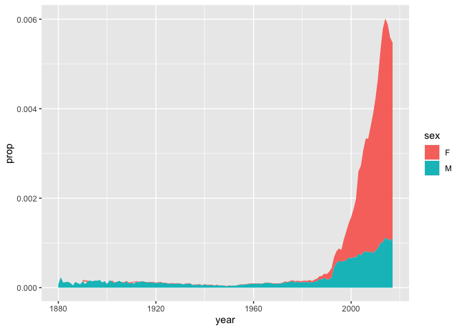

Homework 3
================

I wanted to investigate how a name typically associated with one sex can
shift to be associated with the other sex over time. I limited it to one
specific example, which I decided would be the name Avery, as it is
considered to be both a boy’s and girl’s name currently and I was
curious whether this had changed over time. To do this, I used a dataset
of baby names from the U.S. Social Security Administration and the
tidyverse R package to visualize the data.

``` r
# load tidyverse
library(tidyverse)

# load dataset
library(babynames)
```

``` r
# view dataset
glimpse(babynames)
```

    ## Rows: 1,924,665
    ## Columns: 5
    ## $ year <dbl> 1880, 1880, 1880, 1880, 1880, 1880, 1880, 1880, 1880, 1880, 1880,…
    ## $ sex  <chr> "F", "F", "F", "F", "F", "F", "F", "F", "F", "F", "F", "F", "F", …
    ## $ name <chr> "Mary", "Anna", "Emma", "Elizabeth", "Minnie", "Margaret", "Ida",…
    ## $ n    <int> 7065, 2604, 2003, 1939, 1746, 1578, 1472, 1414, 1320, 1288, 1258,…
    ## $ prop <dbl> 0.07238359, 0.02667896, 0.02052149, 0.01986579, 0.01788843, 0.016…

The dataset includes how many babies of each sex have a certain name for
each year, as well as the proportion of that name compared to all
applicants that year. To investigate how the gender association of the
name Avery has changed over time, I plotted the proportion of babies
named Avery over time and distinguished the sex by color. I used
proportion instead of the total number because it allowed the relative
popularity of the name over time to be compared, as well as allowing
earlier years where there were fewer total applicants to be more easily
visualized.

``` r
# plot using geom_area to show how proportion changes over time
# specify only rows where value in name column = "Avery"
ggplot(data = babynames[babynames$name == "Avery", ]) +
  geom_area(mapping = aes(x = year, y = prop, fill = sex))
```

<!-- -->

Based on this plot, it appears that Avery was primarily a boy’s name up
until the late 1990s, when it not only increased in popularity but
quickly became much more commonly used as a girl’s name rather than a
boy’s name. Currently it appears to be used for baby girls more than 4
times more than it is used for boys. This demonstrates how the
associated gender of names can shift dramatically over the years.
