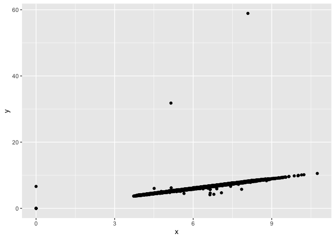

Homework 5
================

``` r
library(tidyverse)
```

## 1.

``` r
diamonds %>%
  count(cut)
```

    ## # A tibble: 5 × 2
    ##   cut           n
    ##   <ord>     <int>
    ## 1 Fair       1610
    ## 2 Good       4906
    ## 3 Very Good 12082
    ## 4 Premium   13791
    ## 5 Ideal     21551

## 2.

``` r
diamonds %>%
  slice_sample(prop = 0.01)
```

    ## # A tibble: 539 × 10
    ##    carat cut       color clarity depth table price     x     y     z
    ##    <dbl> <ord>     <ord> <ord>   <dbl> <dbl> <int> <dbl> <dbl> <dbl>
    ##  1  1.01 Ideal     G     VS1      62.4    58  6951  6.43  6.39  4   
    ##  2  1.12 Ideal     D     I1       60.6    55  4139  6.73  6.76  4.09
    ##  3  0.58 Ideal     G     VS2      61.1    55  1641  5.45  5.42  3.32
    ##  4  0.41 Ideal     D     SI2      62.6    57   656  4.72  4.77  2.97
    ##  5  0.27 Very Good E     VS1      60.2    58   470  4.19  4.22  2.53
    ##  6  0.31 Very Good E     VVS2     61.1    55   766  4.39  4.41  2.69
    ##  7  0.56 Ideal     G     VVS2     62      54  1949  5.28  5.32  3.29
    ##  8  0.41 Premium   D     VVS2     61.8    58  1356  4.79  4.75  2.95
    ##  9  1.03 Ideal     H     SI1      61.1    56  5418  6.5   6.53  3.98
    ## 10  0.75 Premium   F     SI1      61.7    58  2573  5.85  5.88  3.62
    ## # … with 529 more rows

## 3.

``` r
diamonds %>%
  group_by(clarity) %>%
  slice_max(order_by = carat, n = 100, with_ties = FALSE) %>%
  summarise(avg.size = mean(carat))
```

    ## # A tibble: 8 × 2
    ##   clarity avg.size
    ##   <ord>      <dbl>
    ## 1 I1          2.51
    ## 2 SI2         2.62
    ## 3 SI1         2.30
    ## 4 VS2         2.23
    ## 5 VS1         2.10
    ## 6 VVS2        1.66
    ## 7 VVS1        1.51
    ## 8 IF          1.40

## 4.

``` r
ggplot(diamonds, aes(x = x, y = y)) +
  geom_point()
```

<!-- -->

``` r
ggplot(diamonds, aes(x = x, y = z)) +
  geom_point()
```

<!-- -->

## 5.

``` r
diamonds_dubious_pts_rmvd <- diamonds %>%
  filter(!(x <= 0 | y <= 0 | z <= 0 | y > 20 | z > 10))

ggplot(diamonds_dubious_pts_rmvd, aes(x = x, y = y)) +
  geom_point()
```

<!-- -->

``` r
ggplot(diamonds_dubious_pts_rmvd, aes(x = x, y = z)) +
  geom_point()
```

<!-- -->
