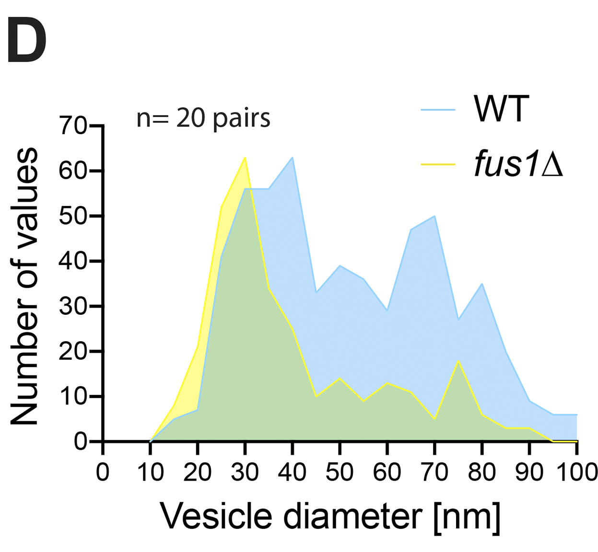
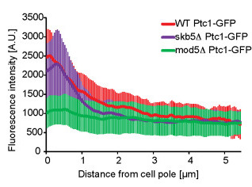

Homework 6
================

## Successful Plot

Figure from Muriel et al., 2021, *Journal of Cell Biology*

-   The vesicle diameter is continuous and is mapped to the x axis
-   The number of values is continuous and is mapped to the y axis
-   The strain (WT or *fus1*) is categorical and is mapped to color
-   The data are displayed using a frequency polygon

This plot is successful because the colors used are easily
distinguishable, including when considering colorblindness, and the
transparency allows the overlap and the differences in distribution to
be clearly seen. It communicates the difference in distribution simply
and clearly. One way this plot could still be improved is the yellow
could be less bright to make it easier to see against the white
background.

## Unsuccessful Plot

Figure from Gerganova et al., 2021, *Molecular Biology of the Cell*

-   Distance from the cell pole is continuous and is mapped to the x
    axis
-   Fluorescence intensity is continuous and is mapped to the y axis
-   The strain is categorical and is mapped to color
-   The data is displayed using a line

I think this plot would be considered ‘bad’ based on Wilke’s ratings.
The design makes it difficult to see and interpret the data, but nothing
is ‘wrong’ since it isn’t mathematically incorrect or misleading.
Because the standard deviation error bars are solid colors, they obscure
each other and make it difficult to see the data. There is also not
enough contrast between the lines and the error bars. In addition, it
uses red and green which would be hard to distinguish if someone is
color blind. The striping caused by using many error bars close together
is also visually unappealing and is what Tufte would consider
“chartjunk”. A partially transparent, smooth visualization of the
standard deviation similar to that seen in the default geom\_smooth
would make this plot look better. Some other ways to improve the plot
according to Tufte’s principles would be to increase the data-ink ratio
by erasing some of the tick marks on the y axis. It would probably be
just as easy to interpret with only the 1000s marked.
