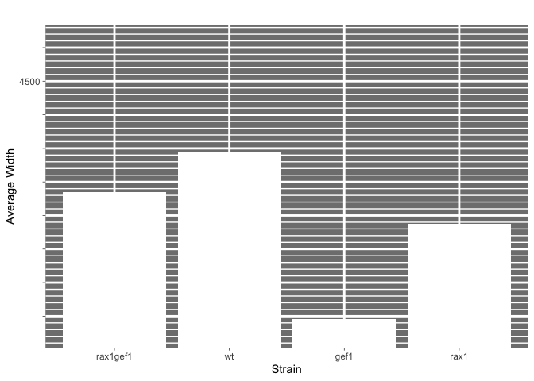
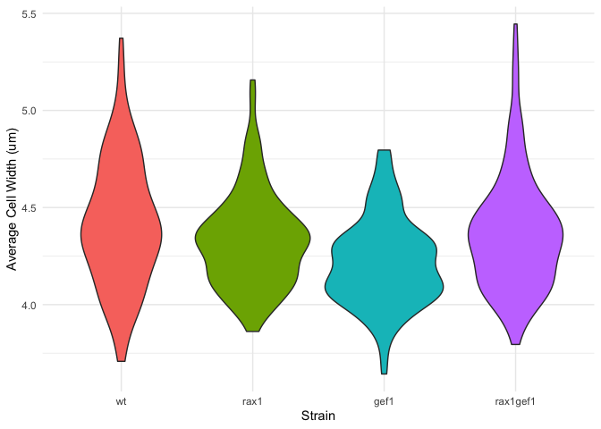

Bad Plot
================

``` r
library(tidyverse)
```

To make this bad plot, I am using my data comparing the width of
different deletion strains of fission yeast cells.

``` r
cell_width <- read_csv("bad_plot/rax1gef1_cell_width.csv", 
                       col_types = cols(
                         replicate = col_factor(), 
                         strain = col_character(), 
                         cell.width = col_double()
                         )
                       )
```

``` r
# Reordering x axis by making the strain column an ordered factor
cell_width$strain <- factor(cell_width$strain, levels = c("rax1gef1", "wt", "gef1", "rax1"))

bad_plot <- cell_width %>%
 group_by(strain) %>%
 summarise(avg.width = mean(cell.width)) %>%
 ggplot(aes(strain, avg.width)) +
 geom_col(fill = "white", show.legend = FALSE) +
 coord_cartesian(ylim = c(4.2, 4.55)) +
  theme_dark() +
  theme(
    panel.grid.minor = element_line(color = "white", size = 0.5),
    panel.grid.major = element_line(color = "white", size = 1),
    ) +
  scale_y_continuous(
    minor_breaks = seq(4.10, 4.60, 0.008), 
    breaks = seq(4.18, 4.58, 0.04), 
    labels = c("","", "", "", "", "", "", "", "4500", "", "")
    ) +
  labs(x = "Strain", y = "Average Width", title = "")
print(bad_plot)
```

<!-- -->

One of the most visible ways this plot is bad is the overuse of grid
lines and the contrast between the bars and the background that makes it
difficult to see clearly. This is a form of what Tufte calls
“chartjunk”, specifically moire vibration (Tufte p. 108). In addition,
the bars are not ordered in a way that makes sense, either by comparing
the different strains or in order of height of the bars, which makes it
more difficult to interpret (Wilke section 6.1). There is also a very
low data-ink ratio, as this only plots 4 data points (Tufte p. 93).
These are the most obvious problems, however this plot is also
misleading.

Only one tick mark is actually labeled, so while you may assume that the
bottom of the bars is zero, that would be incorrect. This plot has been
zoomed in to make the differences in the values appear larger, and the y
axis labels were changed to hide that fact. This distorts the data which
makes it not just bad, but wrong (Wilke section 1, Tufte p. 53). These
values are actually very similar. Finally, the units of the y axis are
not labeled, which makes it confusing to interpret. In this plot, the y
axis is in nm in order to make the differences appear larger, though the
original measurements were taken in um.

Here is a better plot that is easier to look at aesthetically, shows the
overall distribution of the data, has the correct units and labels, and
makes the lack of significant difference more apparent.

``` r
# Change x axis order to a better one
cell_width_2 <- cell_width
cell_width_2$strain <- factor(cell_width_2$strain, levels = c("wt", "rax1", "gef1", "rax1gef1"))

good_plot <- ggplot(cell_width_2, aes(x = strain, y = cell.width)) +
  geom_violin(aes(fill = strain), show.legend = FALSE) +
  theme_minimal() +
  labs(x = "Strain", y = "Average Cell Width (um)")
print(good_plot)
```

<!-- -->
