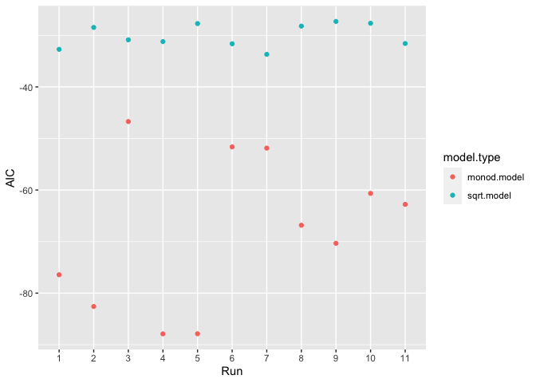

Homework 8
================

## Question 1

``` r
library(tidyverse)
library(modelr)
```

``` r
by_color <- diamonds %>%
  group_by(color) %>%
  nest()

color_model <- function(df) {
  lm(price ~ carat, data = df)
}

by_color <- by_color %>%
  mutate(model = map(data, color_model))

get_slope <- function(fit_obj) {
  slope <- coef(fit_obj)[2]
  slope
}

by_color %>%
  mutate(slope = map_dbl(model, get_slope)) %>%
  arrange(desc(slope))
```

    ## # A tibble: 7 × 4
    ## # Groups:   color [7]
    ##   color data                  model  slope
    ##   <ord> <list>                <list> <dbl>
    ## 1 F     <tibble [9,542 × 9]>  <lm>   8677.
    ## 2 G     <tibble [11,292 × 9]> <lm>   8525.
    ## 3 D     <tibble [6,775 × 9]>  <lm>   8408.
    ## 4 E     <tibble [9,797 × 9]>  <lm>   8296.
    ## 5 I     <tibble [5,422 × 9]>  <lm>   7761.
    ## 6 H     <tibble [8,304 × 9]>  <lm>   7619.
    ## 7 J     <tibble [2,808 × 9]>  <lm>   7094.

## Question 2

``` r
library(nls2)
```

``` r
by_run <- DNase %>%
  group_by(Run) %>%
  nest()

sqrt_model <- function(df) {
  sqrt_mod <- formula(density ~ beta_1 * sqrt(conc) + beta_0)
  nls2(sqrt_mod, data = df, start = list(beta_1 = 0.5, beta_0 = 0.1))
}

monod_model <- function(df) {
  monod_mod <- formula(density ~ (conc * d_max)/(conc + k))
  nls2(monod_mod, data = df, start = list(d_max = 2.06, k = 2.84))
  # starting values determined by choosing 2 random rows of DNase
  # and inputting values into the model formula to form a system of equations
  # which were then solved for k and d_max
}

by_run <- by_run %>%
  mutate(
    sqrt.model = map(data, sqrt_model),
    monod.model = map(data, monod_model)
    )

by_run_long <- by_run %>%
  pivot_longer(c(sqrt.model, monod.model), names_to = "model.type", values_to = "model")

by_run_glance <- by_run_long %>%
  mutate(glance = map(model, broom::glance)) %>%
  unnest(glance)

by_run_glance %>%
  mutate(
    Run = factor(Run, levels = c(1,2,3,4,5,6,7,8,9,10,11)) # reordering x values
    ) %>%
  ggplot(aes(x = Run, y = AIC)) +
  geom_point(mapping = aes(color = model.type))
```

<!-- -->

Since the AIC of the monod model is consistently lower than the AIC of
the square-root model for each run, the monod model appears to be in
general better to use.
